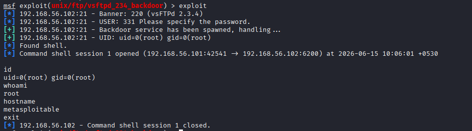
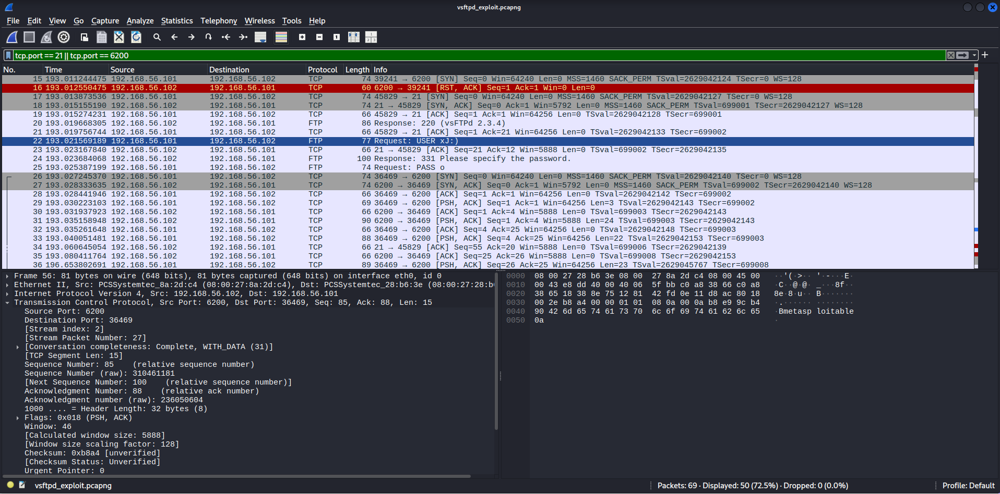

# Cybersecurity Homelab: Penetration Testing Lab

## Objective

Built an isolated penetration testing lab to practice real-world ethical hacking techniques including network reconnaissance, vulnerability exploitation, and traffic analysis.

## Tools Used

- Kali Linux 2026.1 (attacker VM)
- Metasploitable 2 (target VM)
- Oracle VirtualBox 7.2 (virtualization)
- Nmap (network scanning)
- Metasploit Framework (exploitation)
- Wireshark (packet analysis)

## Lab Architecture

- Host-only network: 192.168.56.0/24
- Kali Linux (attacker): 192.168.56.x
- Metasploitable 2 (target): 192.168.56.x
- No internet access for target VM (fully isolated)

## Methodology

### 1. Reconnaissance

Performed full port scan with service version detection:

```
nmap -sV -sC -p- <target-ip> -oN nmap_full_scan.txt
```

Discovered 20+ open ports with vulnerable services.

### 2. Exploitation - vsftpd 2.3.4 Backdoor (CVE-2011-2523)

Used Metasploit module `exploit/unix/ftp/vsftpd_234_backdoor` to exploit a malicious backdoor in the FTP server. The backdoor is triggered by sending a username ending in `:)` which opens a shell listener on port 6200.

Result: Root shell obtained (uid=0).



### 3. Traffic Analysis

Captured exploit traffic in Wireshark. Key observations:
- FTP USER command contains the `:)` backdoor trigger
- New TCP connection established on port 6200
- Shell commands visible in cleartext on port 6200



## Key Findings

| Service | Port | Vulnerability | CVE |
|---------|------|--------------|-----|
| vsftpd 2.3.4 | 21 | Backdoor command execution | CVE-2011-2523 |
| Samba 3.0.20 | 139 | Username map script RCE | CVE-2007-2447 |

## Lessons Learned

- Always scan with `-sV` to identify service versions, not just open ports
- Vulnerable services can be exploited in seconds with the right tools
- Packet captures provide forensic evidence of exactly how an attack works
- Isolated labs are essential for safe, legal security practice

## Files

- `findings/nmap_full_scan.txt` - Full Nmap scan results
- `findings/vsftpd_exploit.pcapng` - Wireshark capture of vsftpd exploitation
- `screenshots/` - Visual documentation of each step